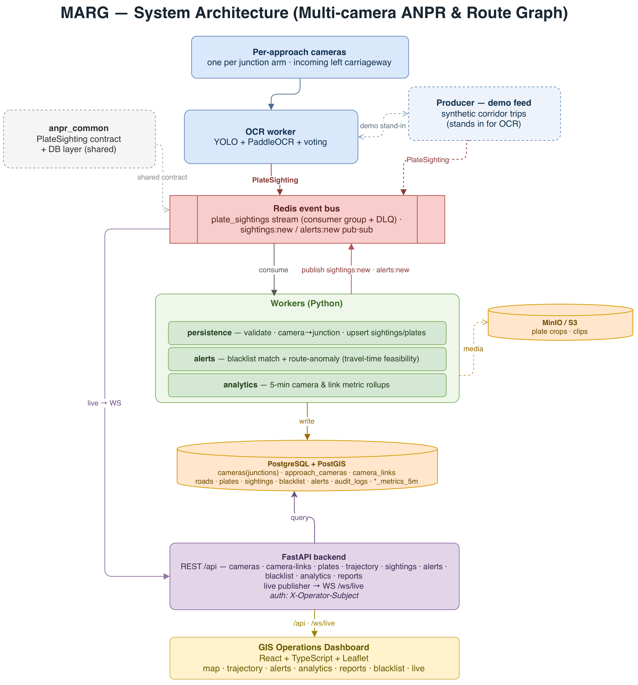

# MARG - Multi-camera ANPR & Route Graph - SIH 2026

A city-wide platform that joins a city's existing CCTV/ANPR cameras into one live
system for **plate recognition, vehicle route tracking on a GIS map, traffic
analytics, and real-time alerts**, all built on the real road network.

## 1. Project Information

- **Live Demo:** [marg-sih.live](https://marg-sih.live/)
- **Demo Video:** [youtu.be/jBPs9ovZqT4](https://youtu.be/jBPs9ovZqT4)
- **Project Title:** MARG - Multi-camera ANPR & Route Graph
- **PS ID:** SIH26127
- **PS Title:** City-Wide AI Engine for Multi-Camera ANPR Trajectory Tracking and Urban Traffic Analytics
- **Category:** Software
- **Theme:** Smart Automation
- **Team ID:** 178542
- **Team Name:** Coding_Uncles

## 2. Problem Statement

Cities run large CCTV + ANPR networks, but each camera works in an **isolated
silo**: it detects a plate, and the read is never linked to any other camera.
Today:

| Problem today | MARG |
|---|---|
| Cameras record in isolation, so the data stays unused | Every camera feeds one live city-wide engine |
| No way to follow one vehicle across the city | Search a plate and rebuild its full route |
| Blacklist checks take hours of manual work | Blacklist alerts in seconds, fully automatic |
| Cloned / fake plates go unnoticed | Impossible-travel check flags clones automatically |
| No city-wide insight for planners | Live congestion, route and bottleneck analytics |
| Wrong-way driving is caught only if an officer sees it | Wrong-way driving flagged automatically from the road graph |

## 3. What Makes MARG Different

- **Road-network-aware engine:** cameras are linked by real roads, not straight
  lines, so every rebuilt route is one a vehicle could actually drive.
- **Clone detection by physics:** if the same plate shows up at two cameras faster
  than the real road allows, one of them is fake. The dashboard gets a real-time
  alert.
- **Court-ready evidence** *(roadmap)*: every sighting hash-chained to the one
  before it, so any edit is detectable, with a one-click evidence packet.
- **Privacy by design:** every lookup is audit-logged today; role-limited lookups
  and auto-deletion of non-flagged data are on the roadmap. Built with the
  DPDP Act 2023 in mind.
- **Ambulance fast route** *(roadmap)*: the least-congested real-road route for
  ambulances, re-routed live if a road jams.

Working demo on **40+ cameras · 17 Dwarka junctions · 48 road links**.

## 4. Technical Approach

One plate read → officer's screen, in seconds:

1. **Read the plate:** one camera per road arm, facing incoming traffic. YOLO finds
   the plate, PaddleOCR reads it, and several frames vote on the result. Every read
   carries a confidence score.
2. **Send a tiny event, not video:** each read becomes a `PlateSighting`
   (plate · camera · time) on Redis Streams. Workers scale out as load grows, and
   a dead-letter queue means no event is lost.
3. **Workers act on it:**
   - *Persistence:* validate, map the camera to its junction, store.
   - *Alerts:* blacklist match, cloned plate (impossible travel time), wrong direction.
   - *Analytics:* flow and speed on every road link, every 5 minutes.
4. **Road graph in PostGIS (the core):** two cameras are linked only if the real
   driving route between them (checked with OSRM) passes no other junction. Each
   link stores its length, free-flow travel time and direction. This is what makes
   routes real and clones catchable.
5. **Live on the dashboard:** FastAPI + WebSocket push each alert the moment it
   fires. The React + Leaflet map shows cameras, routes, alerts, analytics, reports
   and the blacklist.

**Example:** a link is 1.475 km at 50 km/h, so it takes at least 100 s. If the same
plate appears at the other end 30 s later, MARG flags it as a clone.

## 5. Key Features

**Working in the prototype**
- Per-approach ANPR cameras grouped into junctions on a live Leaflet GIS map
- Plate search → full chronological route with timestamps, direction and hops
- Live WebSocket feed of sightings and alerts
- Alerts: blacklist, cloned plate (impossible travel time), wrong direction
- Analytics: node heatmap, link congestion, origin-destination, flow trends, weekly report
- Road-accurate network (OpenStreetMap junctions, OSRM-routed links)
- Audit log of every lookup and blacklist change
- All 6 modules live: Live Map · Trajectory · Alerts · Analytics · Reports · Blacklist.
  Moving from demo data to real camera feeds is a config switch, not a rebuild.

**Roadmap**
- Tamper-evident evidence chain (SHA-256 hash-linked sightings) + one-click court-ready packet
- Role-limited lookups, hashed plates for analytics, auto-deletion of non-flagged data
- Jam forecast 15-30 min ahead, and auto incident alert when a road's flow suddenly drops
- Ambulance least-congested route, re-routed live

## 6. Feasibility and Impact

- **Already working, not a concept:** the full pipeline runs today: plate read →
  stored → rules checked → alert on the dashboard.
- **Cheap to run at city scale:** reuses the city's existing cameras, so no new
  hardware. About 1 KB of text per read against 2-4 Mbps per video stream
  (estimate). Fully open source, no licence fees.
- **Rollout:** 1 corridor → Dwarka → whole city, on-prem, cloud or hybrid. Any city
  can use it by loading its own OpenStreetMap roads.
- **Impact:** a stolen car passing 3 cameras is found hours later from footage
  today. MARG alerts at the first camera and shows its route: **hours → seconds**.

| Risk | How MARG handles it |
|---|---|
| OCR fails at night / in rain | Confidence score + multi-frame voting; low-confidence reads go to a human, not an alert |
| Many camera vendors | One standard sighting format; a vendor needs only a small adapter |
| Camera or network drops out | Failed events go to a dead-letter queue and are retried |
| Citizen privacy | Every lookup logged; role limits and auto-deletion on the roadmap (DPDP Act 2023) |
| Evidence challenged in court | Hash-linked evidence chain (roadmap) |

## 7. Technology Stack

- **Frontend:** React, TypeScript, Leaflet, Vite
- **Backend:** Python, FastAPI (REST + WebSocket)
- **Workers:** Python: OCR (YOLO + PaddleOCR), persistence, alerts, analytics
- **Data & streaming:** PostgreSQL + PostGIS, Redis (streams + pub/sub), MinIO / S3
- **Geospatial:** OpenStreetMap, OSRM routing
- **Deployment:** Docker microservices (Docker Compose); Caddy (automatic HTTPS) for the live demo. Config is URL-driven, so services can be swapped for managed cloud ones.

## 8. Architecture



## 9. Repository Structure

```text
marg-anpr/
├── README.md
├── SUBMISSION_GUIDE.md
├── submission/            # DEMO.md
├── docs/                  # architecture.md/.drawio, plate_sighting_event.md (event contract)
├── assets/                # architecture.png, screenshots/
├── backend/               # FastAPI API service (REST + WebSocket)
├── workers/               # ocr, persistence, alerts, analytics, producer
├── common/anpr_common/    # shared PlateSighting contract + DB layer
├── frontend/              # React + TypeScript + Leaflet dashboard
├── db/                    # schema.sql, seed_dwarka.sql (+ generator), seed_metrics.sql
├── data/
├── docker-compose.yml       # local development stack
├── docker-compose.prod.yml  # production stack (nginx frontend, no public DB ports)
├── Caddyfile                # HTTPS reverse proxy for the live demo
├── requirements.txt
├── .gitignore
└── LICENSE
```

## 10. Final Presentation

[Link](https://drive.google.com/file/d/1fyF8VI5xA1e2VlrA3KYr81EIkH0XfJh3/view?usp=sharing)

## 11. Demo Video

[Watch on YouTube](https://youtu.be/jBPs9ovZqT4)

## 12. Screenshots / Prototype Photos

Add key screens to **`assets/screenshots/`**.

## 13. Installation

```bash
git clone https://github.com/AadityaKhurana/marg-anpr.git
cd marg-anpr
cp .env.example .env
# Python API deps (optional — the full stack runs via Docker below):
pip install -r requirements.txt
```

## 14. Run

The whole stack runs on Docker Compose (Postgres+PostGIS, Redis, MinIO, API, the
workers, the producer, and the frontend):

```bash
docker compose up -d --build          # API :8000, dashboard :5173

# Load the genuine Dwarka demo network (the seed TRUNCATEs, so stop workers first):
docker compose stop producer persistence alerts analytics
docker compose exec -T postgres psql -U anpr -d anpr < db/seed_dwarka.sql
docker compose exec -T postgres psql -U anpr -d anpr < db/seed_metrics.sql
docker compose start producer persistence alerts analytics
```

Open the dashboard at **http://localhost:5173** and the API health at
**http://localhost:8000/health**.

For a production deployment (as used for [marg-sih.live](https://marg-sih.live/)),
set `DOMAIN` in `.env` and run the production stack on its own:

```bash
docker compose -f docker-compose.prod.yml up -d --build
```

> Real OCR (YOLO + PaddleOCR) needs a GPU, model weights and video, so the live
> demo drives the pipeline with a synthetic producer emitting the identical
> `PlateSighting` contract.

## 15. Research and References

- Redmon et al., *You Only Look Once (YOLO)*, CVPR 2016 (arXiv 1506.02640)
- Du et al., *PP-OCR*, 2020 (arXiv 2009.09941)
- arXiv 2207.06657: foreign-trained ANPR models fail on Indian plates, which is why we fine-tune
- Luxen & Vetter, *OSRM*, ACM SIGSPATIAL 2011
- Digital Personal Data Protection Act, 2023
- Road geometry: OpenStreetMap; real Dwarka junction coordinates

## 16. Future Scope

- Run the real OCR engine on live RTSP/video at the edge and benchmark it on Indian plates.
- Build the roadmap items above: evidence chain, privacy controls, jam forecast,
  incident alerts, ambulance routing.
- Multi-city scale-out on managed Postgres/Redis/S3 with horizontal worker scaling.

## 17. Team

Team name: Coding_Uncles (Team ID 178542)

Team Members:
- Aaditya Khurana: 2024UCS1568
- Aashna Gupta: 2024UCS1702
- Armaan Bawa: 2024UIT3317
- Bhavya Chand: 2024UCS1743
- Rasika Gautam: 2024UCM2694
- Saksham Jain: 2024UCS1632
